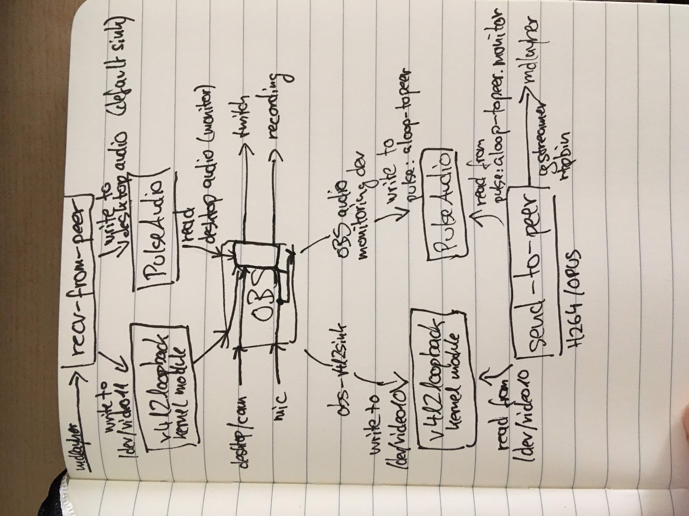

Conceptually, we want to transport the OBS output (video and audio) to another
computer with low latency.

Having OBS stream into a custom RTMP server turned out to have too much latency.



TODO: is netclock something we want? https://github.com/NHGmaniac/gst-videowall/blob/master/lib/netclock.py

dumping a dot graph out of gstreamer: https://developer.ridgerun.com/wiki/index.php/How_to_generate_a_Gstreamer_pipeline_diagram_(graph)

## OBS video setup

Make OBS send its video output not just to stream and recording, but also to
`/dev/video10`:

* Tools
* → v4l2sink
* → device path: `/dev/video10`
* → autostart enabled
* → click start
* → close window

## OBS audio setup

First, point OBS’s monitoring feature to the `snd-loop` ALSA device:

* File
* → Settings
* → Audio
* → Advanced
* → Monitoring device: select the loopback device (name cannot be changed?)

Then, make OBS route your microphone into the monitoring device:

* In the mixer at the bottom of the OBS window, right-click your mic
* → Advanced Audio Properties
* → Audio Monitoring
* → Monitor and Output

## Dependencies

### Debian

| package | version number |
|---------|----------------|
| [v4l2loopback-dkms](https://packages.debian.org/bullseye/v4l2loopback-dkms) | 0.12.5-1 |
| [obs-v4l2sink.deb](https://github.com/CatxFish/obs-v4l2sink/releases/download/0.1.0/obs-v4l2sink.deb) | 0.1.0 |
| gstreamer1.0-alsa | TODO

### Arch Linux

| package | version number |
|---------|----------------|
| [community/v4l2loopback-dkms](https://www.archlinux.org/packages/community/any/v4l2loopback-dkms/) | 0.12.5-1 |
| [AUR:obs-v4l2sink](https://aur.archlinux.org/packages/obs-v4l2sink/) | 0.1.0 |
| [extra/gst-plugins-ugly](TODO) | 1.16.2-3

## Setup

To set up the V4L2 devices `/dev/video10` and `/dev/video11`, as well as the
ALSA `snd-aloop` loop device, run:

```shell
go run setup.go
```

TODO: install setup.go such that it will be run as root after boot

## Sending/receiving a stream

UDP port 5000 to 5007 need to be open.

stapelberg runs:
```
# Read OBS stream video output and monitored audio output from:
#   -v4l2src_device=/dev/video10 and
#   -pulsesrc_device=alsa_output.platform-snd_aloop.0.analog-stereo.monitor
go run send-to-peer.go   -peer=rtp6.servnerr.com -listen=rtp6.zekjur.net

# Write remote stream video/audio to:
#   -v4l2sink_device=/dev/video11 and
#   the default PulseAudio sink (desktop audio)
go run recv-from-peer.go -peer=rtp6.servnerr.com -listen=rtp6.zekjur.net
```

Conversely, mdlayher runs:
```
go run send-to-peer.go   -peer=rtp6.zekjur.net -listen=rtp6.servnerr.com
go run recv-from-peer.go -peer=rtp6.zekjur.net -listen=rtp6.servnerr.com
```

TODO: currently, the receiver needs to be restarted when the sender is restarted
- sender stops
- receiver still prints stats messages, pipeline still playing
- once sender restarts (!), receiver prints PAUSED, then prints READY, and hangs

TODO: check if the converse is also true

TODO: make it so that no restarts are necessary either way
